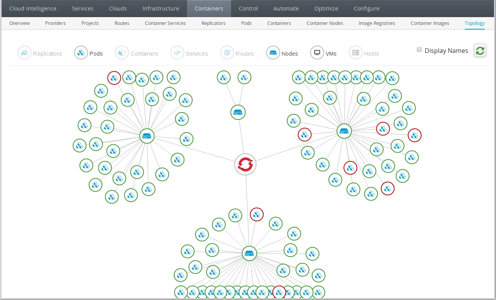

[ManageIQ](https://www.manageiq.org) open source cloud management platform for AWS. It was founded by Red Hat as a community project in 2014, and forms the basis for its CloudForms product. We will use this project to investigate how it performs discovery on AWS, OpenShift/K8s and compare with ServiceNow discovery. We will download the latest ManageIQ AWS baseline which is distributed as an [AWS AMI Appliance ](https://www.manageiq.org/blog/tags/releases/) and comes complete with its own pre-configured PosgreSQL database.

# Prerequisites

* AWS Console Access
* Existing VPC

# Installation

1. Create an S3 Bucket to stage the Appliance using your Profile (e.g. advlab)

    ```
    aws s3 mb s3://advlab-manageiq-bucket --profile advlab
    ```

1. Create a temporary Ubuntu (e.g. v20) EC2 Server called "filetransfer" on "DevOps Demo VPC" as "t2.micro" with a "16G" EBS Disk

1. SSH to "filetransfer"

1. Download Latest Release for AWS (e.g. ManageIQ Lasker GA 1.2 GB)

    ```
    wget https://releases.manageiq.org/manageiq-ec2-lasker-1.zip
    ```

1. Install some tools we may need

    ```
    sudo apt-get update
    sudo apt install awscli zip unzip
    ```

1. Configure AWS Profile and provide your AWS Keys

    ```
    $ aws configure
    AWS Access Key ID [None]: ****
    AWS Secret Access Key [None]: ****
    Default region name [None]: us-east-2
    Default output format [None]: text
    ```

1. Copyt the ManageIQ Image to the S3 Bucket (9.2 GB Unzipped)

    ```
    unzip manageiq-ec2-lasker-1.zip
    aws s3 cp manageiq*.vhd \
       s3://advlab-manageiq-bucket --expected-size=$((1024*1024*1024*10))
    ```

1. Terminate the temporary "filetransfer" instance

1. Create AWS Role

    ```
    aws iam create-role --role-name vmimport --assume-role-policy-document file://vm-import.json --profile=advlab
    ```

1. Edit AWS role-policy.json and set Resource to your S3 Bucket (e.g. advlab-manageiq-bucket)

    ```
    "Resource": [
        "arn:aws:s3:::advlab-manageiq-bucket",
        "arn:aws:s3:::advlab-manageiq-bucket/*"
    ```

1. Create AWS policy

    ```
    aws iam put-role-policy --role-name vmimport --policy-name vmimport --policy-document file://role-policy.json --profile=advlab
    ```

1. Edit AWS Container File (container.json) and set

    ```
    S3Bucket: (e.g. advlab-manageiq-bucket)
    S3Key: (e.g. manageiq-ec2-lasker-1-202107141428.vhd)
    ```

1. Import AWS AMI Image

    ```
    aws ec2 import-image --description "MIQ Lasker 1" --disk-containers file://container.json --region us-east-2 --profile=advlab
    ```

    > NOTE: Note the Import Task ID (e.g. import-ami-0d0db0d9ec4761327)


1. Periodically check the import status

    ```
    watch aws ec2 describe-import-image-tasks --import-task-ids import-ami-0d0db0d9ec4761327 --profile=advlab
    ```

    > NOTES: 
    - Be patient, this takes several minutes to complete
    - Status Message will cycle from `pending > converting > updating > booting > preparing api > completed`
    - Whem complete Note the ImageId (e.g. ami-08ed213f7c2e45ce0 )

1. Change the Image Name

    ```
    aws ec2 copy-image --source-image-id ami-08ed213f7c2e45ce0 --source-region us-east-2 --region us-east-2 --name "miq-morphy-1" --profile=advlab
    ```

1. Delete Working Image

    ```
    aws ec2 deregister-image --image-id ami-08ed213f7c2e45ce0 --profile=advlab
    ```

1. Launch AMI "miq-morphy-1" as "t2.xlarge" and name "ManageIQ Server"

1. Associate Instance to Elastic IP (e.g. 3.134.171.101)

1. Associate DNS to Elastic IP (e.g. https://manageiq.sytes.net)

1. Test Connection using: https://manageiq.sytes.net

    >NOTE: Use intial credentials `admin/smartvm` and change the password

# Troubleshoting

* If the EVM Process does not start as expected you can reset the database as follows:

    * SSH to Master as `cloud-user`

    * Switch to Root User

        ```
        sudo su
        ```

    * Run the Appliance Console utility

        ```
        appliance_console
        ```

    * Select `5. Configure Application`
  
    * Select `4. Reset Configured Database`

    * Select `13. Start EVM Server Processes`